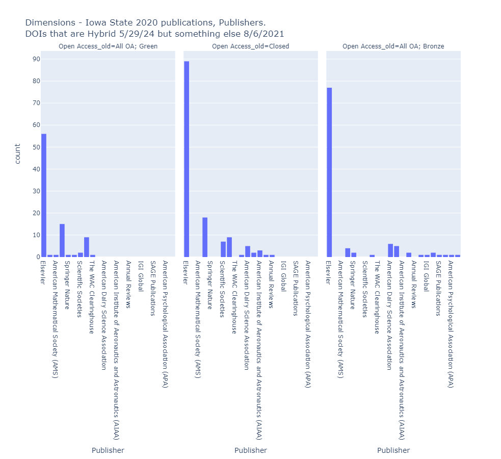
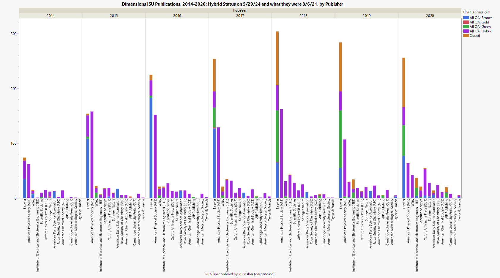

# Hybrid Rates Increasing
I found an old export file of Iowa State University publications from Dimensions, 2014-2020, that was run on 8/6/21. If I re-run the same analysis now, the 2020 Hybrid percentage is twice as high, 7.9% to 15.4%

Comparing the old and new data pulls and OA status can show what changed. 328 DOIs have Hybrid status now and had something different then
- Bronze: 105
- Green: 87
- Closed: 136

Looking at 2020 by publisher shows mostly Elsevier. It’s true they are our biggest publisher, but Wiley is number two and Wiley doesn’t show up here at all so I don’t think it’s a selection issue.

Then I thought maybe the 2021 pull was running into active embargoes of the 2020 articles. So I went back and did 2014 and 2015 as well. They also show an increase in Hybrid numbers and percentage, but not quite doubling.

2014 and 2015 are mostly Elsevier Bronze converting to Elsevier Hybrid.

| ISU only | Run August 2021 | Hybrid | Hybrid % | Run May 2024 | Hybrid | Hybrid % | DOI matched |
|----------|-----------------|--------|----------|--------------|--------|----------|-------------|
| 2014     | 3267            | 180    | 5.51%    | 3433         | 248    | 7.22%    | 3288        |
| 2015     | 3246            | 289    | 8.90%    | 3442         | 458    | 13.31%   | 3220        |
| 2020     | 3989            | 315    | 7.90%    | 4199         | 648    | 15.43%   | 3974        |

Expanding analysis to look at multiple years at a time. This shows DOIs across years with a Hybrid status as of 5/29/24, and what the status was in August 2021. Purple means the OA classification is consistent. Elsevier is the publisher that has the most inconsistent OA status.

